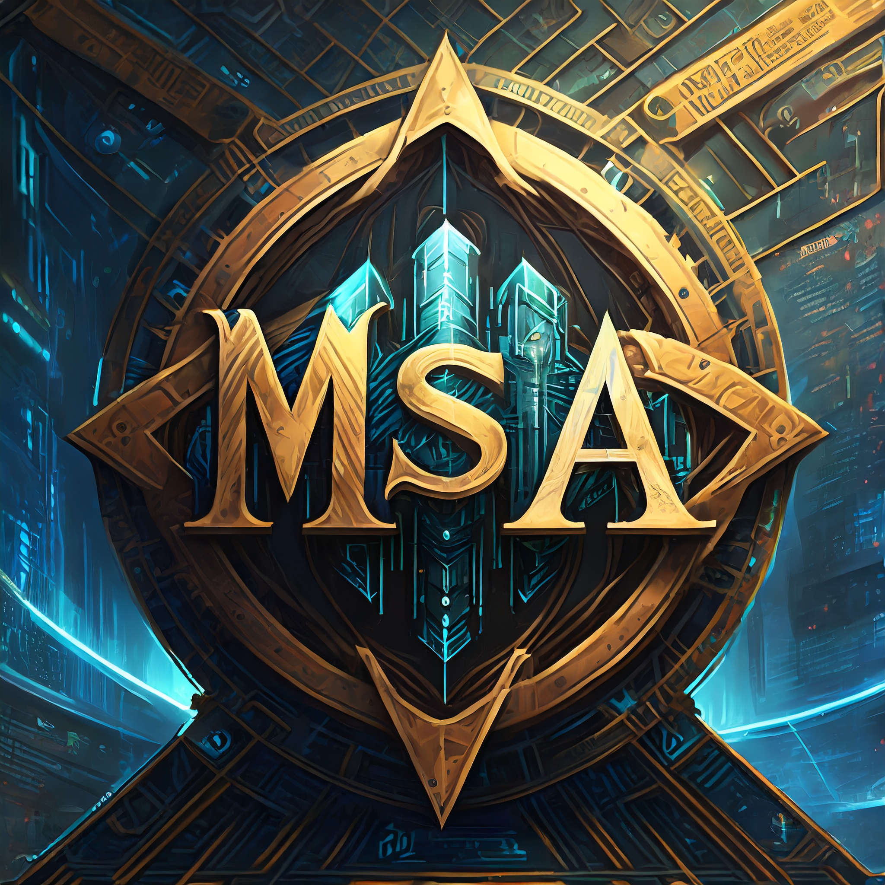

# Mosaic

---

## Description

Mosaic is a brand new programming language for educational purposes. Implementation is based on [Crafting Interpreters](https://craftinginterpreters.com/) book by **Bob Nystrom**. It's main goal is to be a simple, easy to learn language that can be used for a variety of purposes. It is currently in development, and is not ready for use.

The language, virtual machine and compiler are written in **Rust**, and the standard library is written in Mosaic itself.

The name of programming language is Mosaic Script (or just Mosaic) and it's acronym is **mos**. Inspering by the acronym file extension of mosaic's source files named as `.mos`. For example `main.mos`, `hello_world.mos`, `merge_sort.mos` and etc.